# Use Case Diagram - Antonette's Pastries System

## System Overview
This Use Case Diagram shows the interactions between different types of users (Customers, Registered Users, and Admins) with the Antonette's Pastries web-based marketing and management system.

## Visual Use Case Diagram

```mermaid
graph TD
    %% Actors
    Customer[👤 Customer<br/>Anonymous User]
    RegisteredUser[👤 Registered User<br/>Logged-in Customer]
    Admin[👤 Admin<br/>System Administrator]
    
    %% System Boundary
    subgraph System["🏪 Antonette's Pastries System"]
        %% Customer Use Cases
        subgraph CustomerUC["Customer Use Cases"]
            BrowseProducts[Browse Products]
            ViewProductDetails[View Product Details]
            SearchProducts[Search Products]
            FilterProducts[Filter Products by Category]
            SortProducts[Sort Products by Price]
            ViewAbout[View About Page]
            ViewContact[View Contact Information]
            SubmitContactForm[Submit Contact Form]
            RegisterAccount[Register Account]
            Login[Login to Account]
            AddToCart[Add Products to Cart]
            ViewCart[View Cart Contents]
            UpdateCartQuantities[Update Cart Quantities]
            RemoveFromCart[Remove Items from Cart]
            ProceedCheckout[Proceed to Checkout]
            PlaceOrder[Place Order]
            ViewOrderHistory[View Order History]
            TrackOrderStatus[Track Order Status]
            CancelOrders[Cancel Pending Orders]
            ManageProfile[Manage Profile Information]
            UpdatePersonalDetails[Update Personal Details]
            ChangePassword[Change Password]
            Logout[Logout]
        end
        
        %% Admin Use Cases
        subgraph AdminUC["Admin Use Cases"]
            AdminLogin[Admin Login]
            ViewDashboardStats[View Dashboard Statistics]
            ViewTotalProducts[View Total Products Count]
            ViewTotalOrders[View Total Orders Count]
            ViewTotalCustomers[View Total Customers Count]
            ViewTotalRevenue[View Total Revenue]
            ViewRecentOrders[View Recent Orders]
            AddNewProducts[Add New Products]
            EditProducts[Edit Existing Products]
            DeleteProducts[Delete Products]
            UploadProductImages[Upload Product Images]
            ManageCategories[Manage Product Categories]
            UpdatePrices[Update Product Prices]
            ViewProductInterface[View Product Management Interface]
            AdminLogout[Admin Logout]
        end
    end
    
    %% Customer Connections
    Customer --> BrowseProducts
    Customer --> ViewProductDetails
    Customer --> SearchProducts
    Customer --> FilterProducts
    Customer --> SortProducts
    Customer --> ViewAbout
    Customer --> ViewContact
    Customer --> SubmitContactForm
    Customer --> RegisterAccount
    Customer --> Login
    Customer --> AddToCart
    Customer --> ViewCart
    Customer --> UpdateCartQuantities
    Customer --> RemoveFromCart
    Customer --> ProceedCheckout
    Customer --> PlaceOrder
    Customer --> ViewOrderHistory
    Customer --> TrackOrderStatus
    Customer --> CancelOrders
    Customer --> ManageProfile
    Customer --> UpdatePersonalDetails
    Customer --> ChangePassword
    Customer --> Logout
    
    %% Registered User inherits all Customer use cases
    RegisteredUser --> BrowseProducts
    RegisteredUser --> ViewProductDetails
    RegisteredUser --> SearchProducts
    RegisteredUser --> FilterProducts
    RegisteredUser --> SortProducts
    RegisteredUser --> ViewAbout
    RegisteredUser --> ViewContact
    RegisteredUser --> SubmitContactForm
    RegisteredUser --> RegisterAccount
    RegisteredUser --> Login
    RegisteredUser --> AddToCart
    RegisteredUser --> ViewCart
    RegisteredUser --> UpdateCartQuantities
    RegisteredUser --> RemoveFromCart
    RegisteredUser --> ProceedCheckout
    RegisteredUser --> PlaceOrder
    RegisteredUser --> ViewOrderHistory
    RegisteredUser --> TrackOrderStatus
    RegisteredUser --> CancelOrders
    RegisteredUser --> ManageProfile
    RegisteredUser --> UpdatePersonalDetails
    RegisteredUser --> ChangePassword
    RegisteredUser --> Logout
    
    %% Admin Connections
    Admin --> AdminLogin
    Admin --> ViewDashboardStats
    Admin --> ViewTotalProducts
    Admin --> ViewTotalOrders
    Admin --> ViewTotalCustomers
    Admin --> ViewTotalRevenue
    Admin --> ViewRecentOrders
    Admin --> AddNewProducts
    Admin --> EditProducts
    Admin --> DeleteProducts
    Admin --> UploadProductImages
    Admin --> ManageCategories
    Admin --> UpdatePrices
    Admin --> ViewProductInterface
    Admin --> AdminLogout
    
    %% Include relationships
    PlaceOrder -.->|includes| ProceedCheckout
    AddToCart -.->|includes| ViewProductDetails
    EditProducts -.->|includes| ViewProductInterface
    
    %% Extend relationships
    CancelOrders -.->|extends| ViewOrderHistory
    UpdatePrices -.->|extends| EditProducts
```



## Use Case Diagram (Text Format)

```
┌─────────────────────────────────────────────────────────────────────────────────────┐
│                           Antonette's Pastries System                              │
├─────────────────────────────────────────────────────────────────────────────────────┤
│                                                                                     │
│  ┌─────────────┐                                                                   │
│  │   Customer  │                                                                   │
│  │ (Anonymous) │                                                                   │
│  └─────────────┘                                                                   │
│           │                                                                        │
│           │ ┌─────────────────────────────────────────────────────────────────┐    │
│           │ │                      Customer Use Cases                        │    │
│           │ │                                                               │    │
│           │ │  • Browse Products                                            │    │
│           │ │  • View Product Details                                       │    │
│           │ │  • Search Products                                            │    │
│           │ │  • Filter Products by Category                               │    │
│           │ │  • Sort Products by Price                                    │    │
│           │ │  • View About Page                                           │    │
│           │ │  • View Contact Information                                  │    │
│           │ │  • Submit Contact Form                                       │    │
│           │ │  • Register Account                                          │    │
│           │ │  • Login to Account                                          │    │
│           │ │  • Add Products to Cart                                      │    │
│           │ │  • View Cart Contents                                        │    │
│           │ │  • Update Cart Quantities                                    │    │
│           │ │  • Remove Items from Cart                                    │    │
│           │ │  • Proceed to Checkout                                       │    │
│           │ │  • Place Order                                               │    │
│           │ │  • View Order History                                        │    │
│           │ │  • Track Order Status                                        │    │
│           │ │  • Cancel Pending Orders                                     │    │
│           │ │  • Manage Profile Information                                │    │
│           │ │  • Update Personal Details                                   │    │
│           │ │  • Change Password                                           │    │
│           │ │  • Logout                                                    │    │
│           │ │                                                               │    │
│           │ └─────────────────────────────────────────────────────────────────┘    │
│           │                                                                        │
│  ┌─────────────┐                                                                   │
│  │    Admin    │                                                                   │
│  │             │                                                                   │
│  └─────────────┘                                                                   │
│           │                                                                        │
│           │ ┌─────────────────────────────────────────────────────────────────┐    │
│           │ │                      Admin Use Cases                           │    │
│           │ │                                                               │    │
│           │ │  • Admin Login                                                │    │
│           │ │  • View Dashboard Statistics                                  │    │
│           │ │  • View Total Products Count                                  │    │
│           │ │  • View Total Orders Count                                    │    │
│           │ │  • View Total Customers Count                                 │    │
│           │ │  • View Total Revenue                                         │    │
│           │ │  • View Recent Orders                                         │    │
│           │ │  • Add New Products                                           │    │
│           │ │  • Edit Existing Products                                     │    │
│           │ │  • Delete Products                                            │    │
│           │ │  • Upload Product Images                                      │    │
│           │ │  • Manage Product Categories                                  │    │
│           │ │  • Update Product Prices                                      │    │
│           │ │  • View Product Management Interface                          │    │
│           │ │  • Admin Logout                                               │    │
│           │ │                                                               │    │
│           │ └─────────────────────────────────────────────────────────────────┘    │
│                                                                                     │
└─────────────────────────────────────────────────────────────────────────────────────┘
```

## Detailed Use Case Descriptions

### Customer Use Cases

#### **Product Browsing & Discovery**
- **Browse Products**: View all available pastries with pagination
- **View Product Details**: See detailed information about specific products
- **Search Products**: Find products by name, description, or category
- **Filter Products**: Narrow down products by category (Cakes, Cookies, etc.)
- **Sort Products**: Arrange products by price (low to high, high to low)

#### **Account Management**
- **Register Account**: Create a new customer account
- **Login to Account**: Authenticate with username/email and password
- **Manage Profile Information**: View and update personal details
- **Update Personal Details**: Modify name, email, phone number
- **Change Password**: Update account password
- **Logout**: End user session

#### **Shopping Cart Operations**
- **Add Products to Cart**: Add items with specific quantities
- **View Cart Contents**: See all items in shopping cart
- **Update Cart Quantities**: Increase or decrease item quantities
- **Remove Items from Cart**: Delete items from cart
- **Proceed to Checkout**: Initiate the order process

#### **Order Management**
- **Place Order**: Complete purchase with order details
- **View Order History**: See all past orders
- **Track Order Status**: Monitor order progress (pending, confirmed, preparing, ready, completed)
- **Cancel Pending Orders**: Cancel orders that haven't been prepared yet

#### **Information & Support**
- **View About Page**: Learn about the bakery's story and team
- **View Contact Information**: See business details and location
- **Submit Contact Form**: Send messages or inquiries

### Admin Use Cases

#### **Authentication & Dashboard**
- **Admin Login**: Authenticate as administrator
- **View Dashboard Statistics**: See overview of business metrics
- **View Total Products Count**: Monitor product inventory
- **View Total Orders Count**: Track order volume
- **View Total Customers Count**: Monitor customer base
- **View Total Revenue**: Track business earnings
- **View Recent Orders**: Monitor latest customer orders
- **Admin Logout**: End admin session

#### **Product Management**
- **Add New Products**: Create new pastry items with details
- **Edit Existing Products**: Modify product information
- **Delete Products**: Remove products from catalog
- **Upload Product Images**: Add photos to product listings
- **Manage Product Categories**: Organize products by type
- **Update Product Prices**: Modify pricing information
- **View Product Management Interface**: Access admin product controls

## Use Case Relationships

### **Generalization**
- **Customer** (Anonymous) and **Registered User** are specializations of **User**
- **Admin** is a specialized type of **User** with elevated privileges

### **Include Relationships**
- **Place Order** includes **Proceed to Checkout**
- **Add Products to Cart** includes **View Product Details**
- **Edit Existing Products** includes **View Product Management Interface**

### **Extend Relationships**
- **Cancel Pending Orders** extends **View Order History** (only for pending orders)
- **Update Product Prices** extends **Edit Existing Products**

## System Boundaries

### **Internal System Components**
- User Authentication System
- Product Catalog Database
- Shopping Cart Management
- Order Processing System
- Admin Dashboard
- Customer Profile Management

### **External Systems**
- Email Notification System (for order confirmations)
- Payment Processing (future enhancement)
- Inventory Management (future enhancement)

## Business Rules

### **Customer Rules**
- Must register/login to place orders
- Can only cancel orders that are still pending
- Cart contents persist across browser sessions
- Must provide valid contact information for orders

### **Admin Rules**
- Only users with admin role can access admin functions
- Cannot add items to cart (admin restriction)
- Must authenticate to access admin dashboard
- Can manage all products and view all orders

This Use Case Diagram provides a comprehensive view of all the functionalities available to different types of users in the Antonette's Pastries system.

## Summary - Main User and Admin Capabilities

### **👤 USER CAPABILITIES (Customers & Registered Users)**

#### **🛒 Shopping & Ordering**
- **Browse Products** - View all available pastries
- **Search & Filter** - Find products by name, category, or price
- **Add to Cart** - Add items to shopping cart
- **Manage Cart** - Update quantities, remove items
- **Place Orders** - Complete purchases
- **Track Orders** - Monitor order status and history
- **Cancel Orders** - Cancel pending orders

#### **👤 Account Management**
- **Register Account** - Create new user account
- **Login/Logout** - Access and exit account
- **Manage Profile** - Update personal information
- **Change Password** - Update account security

#### **ℹ️ Information Access**
- **View About Page** - Learn about the bakery
- **Contact Support** - Submit inquiries and feedback
- **View Product Details** - See detailed product information

---

### **👨‍💼 ADMIN CAPABILITIES**

#### **📊 Dashboard & Analytics**
- **View Statistics** - Monitor total products, orders, customers, revenue
- **Track Performance** - View recent orders and business metrics
- **Access Admin Panel** - Secure administrative interface

#### **📦 Product Management**
- **Add Products** - Create new pastry items
- **Edit Products** - Modify existing product information
- **Delete Products** - Remove items from catalog
- **Manage Categories** - Organize products by type
- **Update Prices** - Modify product pricing
- **Upload Images** - Add product photos

#### **🔐 System Access**
- **Admin Login** - Authenticate as administrator
- **Admin Logout** - Exit admin session
- **Full System Control** - Complete management capabilities

---

### **🔑 Key Differences**

| **Users** | **Admins** |
|-----------|------------|
| ✅ Browse and shop | ❌ Cannot add to cart |
| ✅ Place orders | ✅ Manage all products |
| ✅ View their own data | ✅ View all system data |
| ✅ Cancel their orders | ✅ Access admin dashboard |
| ✅ Manage own profile | ✅ Full system control |

### **🚫 User Restrictions**
- **Admin users cannot add items to cart** (admin restriction)
- **Users can only manage their own orders and profile**
- **Users cannot access admin functions**

### **🎯 Main Business Functions**

**For Users:**
1. **Shop** - Browse, search, and purchase pastries
2. **Order** - Place and track orders
3. **Account** - Manage personal information

**For Admins:**
1. **Manage** - Control products and inventory
2. **Monitor** - Track business performance
3. **Administer** - Full system administration

This summary shows the core functionalities that define what each type of user can do in the Antonette's Pastries system.
