# User Registration System - Data Flow Diagram (DFD)

## Visual DFD - User Registration Process

```mermaid
graph TD
    %% Actors and External Entities
    User[👤 User]
    
    %% System Boundary
    subgraph System["🏪 User Registration System"]
        %% Level 0 Process
        RegisterUser[1.0 Register User]
        
        %% Level 1 Processes
        ValidateInput[1.1 Validate Input]
        CheckDuplicate[1.2 Check Duplicate Users]
        CreateUser[1.3 Create New User]
        SendConfirmation[1.4 Send Confirmation]
        
        %% Data Store
        UsersDB[(D1 Users Database)]
    end
    
    %% External to System flows
    User -->|Registration Form Data| RegisterUser
    RegisterUser -->|Registration Response| User
    
    %% Internal flows
    RegisterUser -->|Registration Request| ValidateInput
    ValidateInput -->|Validation Response| User
    ValidateInput -->|Validated Data| CheckDuplicate
    CheckDuplicate -->|Check Existing Users| UsersDB
    UsersDB -->|User Exists/Not Exists| CheckDuplicate
    CheckDuplicate -->|Unique User Data| CreateUser
    CreateUser -->|Store User Data| UsersDB
    UsersDB -->|User Created| CreateUser
    CreateUser -->|Success Response| SendConfirmation
    SendConfirmation -->|Notification| User
    User -->|User Feedback| SendConfirmation
```



## Level 0 DFD - User Registration System

```
┌─────────────┐    Registration Form Data    ┌─────────────────┐
│             │ ──────────────────────────▶ │                 │
│    User     │                             │ 1.0 Register    │
│             │                             │    User         │
│             │ ◀────────────────────────── │                 │
└─────────────┘    Registration Response     └─────────┬───────┘
                                                      │
                                                      │ User Data
                                                      ▼
┌─────────────┐    User Information    ┌─────────────────────────────┐
│             │ ◀───────────────────── │                             │
│ D1 Users    │                       │ 1.0 Register User           │
│ Database    │ ─────────────────────▶ │                             │
└─────────────┘   Verification Check   └─────────────────────────────┘
```

## Level 1 DFD - Detailed Registration Process

```
┌─────────────┐    Registration Request    ┌─────────────────┐
│             │ ──────────────────────────▶ │                 │
│    User     │                             │ 1.1 Validate    │
│             │                             │     Input       │
│             │ ◀────────────────────────── │                 │
└─────────────┘    Validation Response     └─────────┬───────┘
                                                      │
                                                      │ Validated Data
                                                      ▼
┌─────────────┐    Check Existing Users    ┌─────────────────────────────┐
│             │ ◀───────────────────────── │                             │
│ D1 Users    │                           │ 1.2 Check Duplicate         │
│ Database    │ ─────────────────────────▶ │     Users                   │
└─────────────┘   User Exists/Not Exists   └─────────────────────────────┘
                                                      │
                                                      │ Unique User Data
                                                      ▼
┌─────────────┐    Store User Data    ┌─────────────────────────────┐
│             │ ◀───────────────────── │                             │
│ D1 Users    │                       │ 1.3 Create New User         │
│ Database    │ ─────────────────────▶ │                             │
└─────────────┘   User Created        └─────────────────────────────┘
                                                      │
                                                      │ Success Response
                                                      ▼
┌─────────────┐    Notification    ┌─────────────────────────────┐
│             │ ◀───────────────── │                             │
│    User     │                   │ 1.4 Send Confirmation       │
│             │ ─────────────────▶ │                             │
└─────────────┘   User Feedback    └─────────────────────────────┘
```

## Data Flow Details:

### External Entity:
- **User**: The person registering for a new account

### Processes:
- **1.0 Register User**: Main process that handles user registration
- **1.1 Validate Input**: Validates registration form data
- **1.2 Check Duplicate Users**: Ensures username/email are unique
- **1.3 Create New User**: Stores user data in database
- **1.4 Send Confirmation**: Provides feedback to user

### Data Store:
- **D1 Users Database**: Database containing user information and credentials

### Data Flows:
1. **Registration Form Data** → From User to Register User process
2. **Registration Response** → From Register User process to User
3. **User Data** → From Register User process to Users Database
4. **Verification Check** → From Users Database back to Register User process
5. **Validation Response** → From Validate Input process to User
6. **Validated Data** → From Validate Input to Check Duplicate Users process
7. **Check Existing Users** → From Check Duplicate Users to Users Database
8. **User Exists/Not Exists** → From Users Database to Check Duplicate Users process
9. **Unique User Data** → From Check Duplicate Users to Create New User process
10. **Store User Data** → From Create New User to Users Database
11. **User Created** → From Users Database to Create New User process
12. **Success Response** → From Create New User to Send Confirmation process
13. **Notification** → From Send Confirmation to User
14. **User Feedback** → From User to Send Confirmation process

## Simple Explanation:

### Registration Process Flow:

1. **User** fills out registration form with:
   - Username, Email, Password, Confirm Password
   - First Name, Last Name, Phone Number
   - Address, City, State, ZIP Code

2. **Validate Input** process checks:
   - All required fields are filled
   - Password matches confirm password
   - Password meets minimum length (6 characters)
   - Email format is valid

3. **Check Duplicate Users** process:
   - Queries Users Database for existing username
   - Queries Users Database for existing email
   - Returns "User Exists" or "Not Exists"

4. **Create New User** process:
   - Hashes the password securely
   - Inserts new user record into Users Database
   - Sets user as verified and active
   - Returns success confirmation

5. **Send Confirmation** process:
   - Shows success notification to user
   - Switches to login form
   - Clears registration form

## Registration Data Structure:

```json
{
  "username": "john_doe",
  "email": "john@example.com",
  "password": "hashed_password",
  "first_name": "John",
  "last_name": "Doe",
  "phone": "09123456789",
  "address": "123 Main Street",
  "city": "Manila",
  "state": "Metro Manila",
  "zip_code": "1000",
  "role": "customer",
  "is_active": 1,
  "email_verified": 1,
  "created_at": "2024-01-01 10:00:00"
}
```

## Validation Rules:

### **Required Fields:**
- Username, Email, Password, Confirm Password
- First Name, Last Name, Address, City, State, ZIP Code

### **Validation Checks:**
- Password minimum length: 6 characters
- Password confirmation must match
- Username and email must be unique
- Email format validation

### **Security Features:**
- Password hashing using PHP's password_hash()
- Automatic email verification (set to verified)
- User account activated immediately
- Default role set to "customer"

## Error Handling:

### **Possible Errors:**
1. **Missing Required Fields**: "Missing required fields. All address information is mandatory."
2. **Weak Password**: "Password must be at least 6 characters"
3. **Password Mismatch**: "Passwords do not match"
4. **Duplicate Username/Email**: "Username or email already exists"
5. **Database Error**: "Registration failed: [error message]"

### **Success Response:**
- "Registration successful! You can now log in to your account."
- Form switches to login mode
- Registration form is cleared

This DFD shows the complete user registration workflow in the Antoinette's Pastries system!
